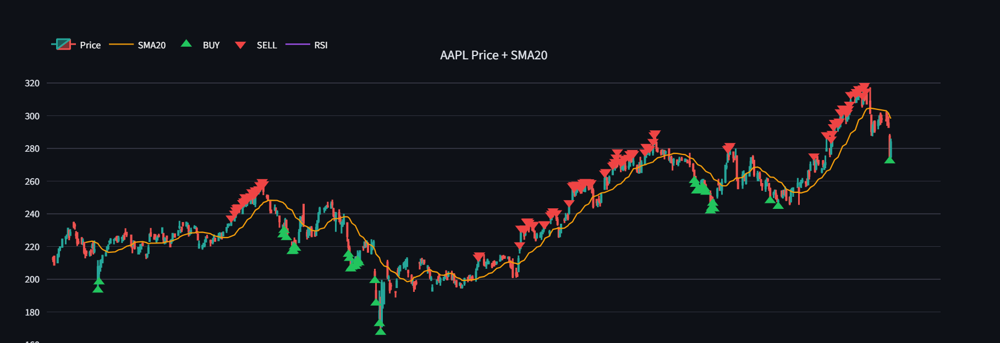
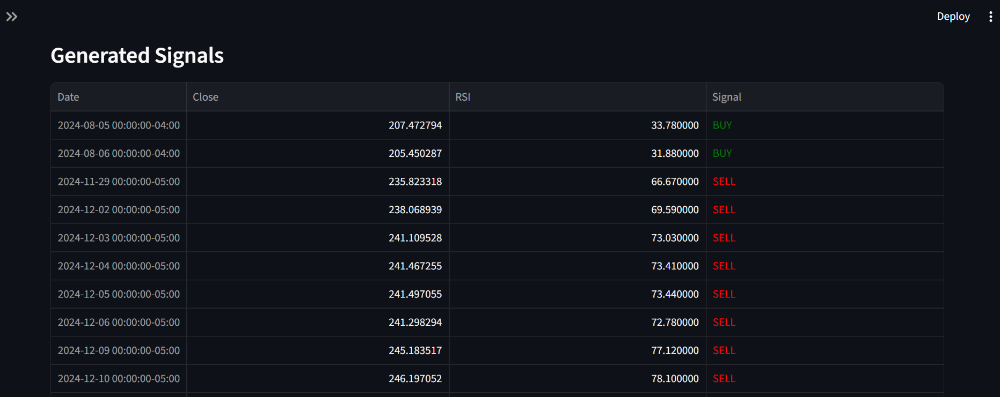

# 📈 Live Stock Price Tracker

A real-time stock analysis dashboard built with Python and Streamlit.

## 🔗 Live Demo
👉 [Click here to view the live app](https://stocktracker-u5mjudmjq7ynja2oc7xqfn.streamlit.app/)

## Features
- 📊 Live candlestick price chart with SMA20 overlay
- 📉 RSI (14) indicator with overbought/oversold signals
- 🟢 Automatic BUY/SELL signal detection
- 🔍 Supports any stock symbol (AAPL, TSLA, MSFT, NVDA etc.)
- 📅 Configurable time periods (1mo to 2y)

## Tech Stack
- Python
- Streamlit
- Plotly
- Pandas
- yfinance

## 📊 AAPL Price Chart

## 📈 RSI + SSMA Analysis

## 🚦 Generated Trading Signals (Table)

## How to Run Locally
pip install -r requirements.txt
python -m streamlit run app.py
